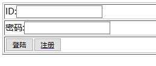
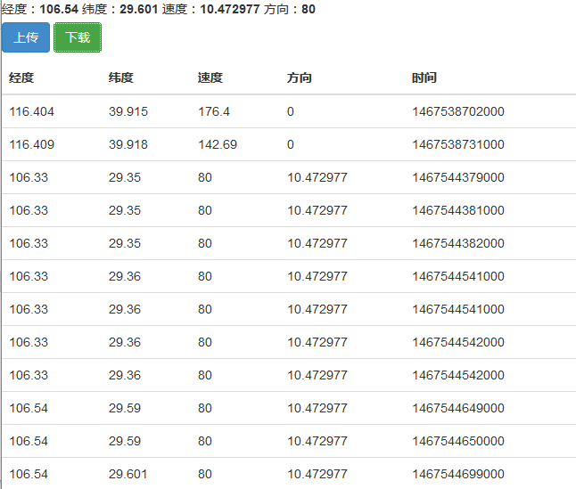
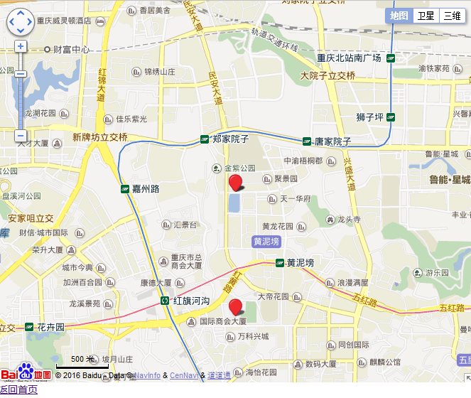

# locations

简单的基于spring+springmvc+hibernate框架的系统，实现了用户登录注册功能。

移动端登录后，页面顶部显示当前经纬度和速度方向等信息。

点击“上传”按钮，把当前位置信息存到服务器；点击“下载”按钮，从服务器获取存储的历史位置信息数据。数据交互格式为json格式。

点击最下方的“地图显示”连接，则跳转到新的页面显示上图列表最新的两个位置点在地图中的位置。

